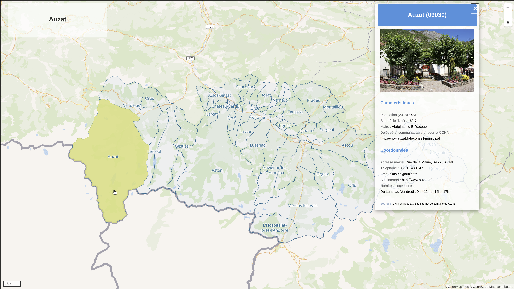

# Méthodologie de création de la carte dynamique
Lien démo : https://ccha.netlify.app/

## 1. Création du CSV

Les informations renseignées pour chaque commune dans le CSV sont les suivantes:

- URL de la photo de la commune ([Wikipedia](https://fr.wikipedia.org/wiki/Communaut%C3%A9_de_communes_de_la_Haute-Ari%C3%A8ge))
- Nom de la commune ([Wikipedia](https://fr.wikipedia.org/wiki/Communaut%C3%A9_de_communes_de_la_Haute-Ari%C3%A8ge))
- Population ([Wikipedia](https://fr.wikipedia.org/wiki/Communaut%C3%A9_de_communes_de_la_Haute-Ari%C3%A8ge))
- Superficie au km2 ([Wikipedia](https://fr.wikipedia.org/wiki/Communaut%C3%A9_de_communes_de_la_Haute-Ari%C3%A8ge))
- Densité du nombre d'habitants/km2 ([Wikipedia](https://fr.wikipedia.org/wiki/Communaut%C3%A9_de_communes_de_la_Haute-Ari%C3%A8ge))
- Maire ([Wikipedia](https://fr.wikipedia.org/wiki/Communaut%C3%A9_de_communes_de_la_Haute-Ari%C3%A8ge))
- Délégué(s) communautaire(s) pour la CCHA (lien de la page vers la liste des membres du conseil municipal lorsque le site internet existe)
- Adresse (site internet si existant ou [Annuaire service publique](https://lannuaire.service-public.fr/occitanie/ariege/))
- Téléphone (site internet si existant ou [Annuaire service publique](https://lannuaire.service-public.fr/occitanie/ariege/))
- Mail (site internet si existant ou [Annuaire service publique](https://lannuaire.service-public.fr/occitanie/ariege/))
- Site Internet (site internet si existant ou [Annuaire service publique](https://lannuaire.service-public.fr/occitanie/ariege/))
- Horaires d’ouverture (site internet si existant ou [Annuaire service publique](https://lannuaire.service-public.fr/occitanie/ariege/))

## 2. Création de la carte dynamique avec Maplibre

- Les contours et labels de communes proviennent de [Makina Maps](https://makinamaps.makina-corpus.net/)

- Les données attributaires proviennent du CSV précédemment construit : https://github.com/bruhnild/ccha/blob/main/data/ccha.csv

### Ressources utilisées: 

- https://labs.mapbox.com/education/impact-tools/data-joins/
- https://github.com/mapbox/impact-tools/blob/master/data-joins/index.html

**Dépot Github** : https://github.com/bruhnild/ccha
